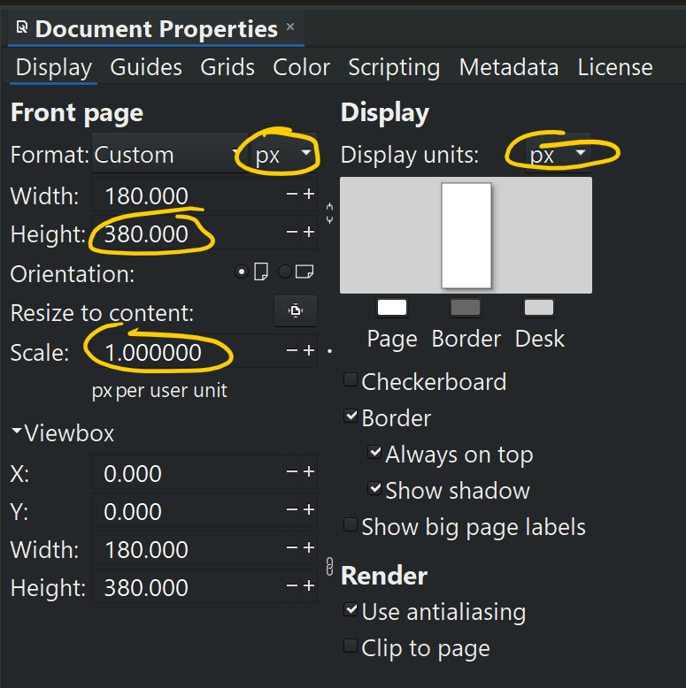

# Panels

My usual workflow for a new module is to prototype the panel design before I even start coding a module.
Sometimes I will also write a draft of the documentation before coding.
This helps me work out whether the design is sensical and can be easily explained and understood.
Other devs do it the other way around: they don't worry much about the panel design until after they have a working module, and sometimes never get around to documentation, much to the dismay of some users.

I have a collection of stock SVG components (knobs, sliders, ports) that I can import or copy/paste that get removed for the actual running panel.
After I have this initial design up and running in a Rack module, there is a bit of transitional Inkscape process to eliminate transforms. To eliminate transformms, ungroup everything that is grouped, then re-group.
After that I hand-edit the SVGs as text.
I edit out all traces of inkscape.
All changes after that are in the VSCode text editor, with svg text / preview side-by-side.

A text editor is easier for me to ensure consistent colors, stroke widths, and positioning across modules.
I can copy/paste then adjust coordinates and dimensions.

I use SVG hot-reloading ([Hot-reload SVGs](./hot-svg.md#hot-reload-svgs)).
This makes it quick and easy to make live, fine-grained adjustments.

## Inkscape tips

- **Use pixel (px) coordinates.**
  Ignore the Rack guide that says to use millimeter (mm) units.
  That's only useful if you are trying to exactly replicate a specific physical Eurorack Module.
  Even then, the conversion is easily done because you can convert mm to px by entering the expression _mm_ `*2.95` in the toolbar.
  Rack's assets don't consistently follow it's own guide here.

- Set up your SVG document like this: the most important items to set are circled -- the others are per your preference.

  

  With these settings, all your widget positioning code works in pixels: the same units that the Rack display system uses.
  This allows for precise pixel positioning with a minimum of artifacts.
  Your code doesn't need `mm2px` everywhere.

- **Position and size using the toolbar**, instead of dragging with the mouse.
  You can copy/paste exact locations and dimensions for consistency.

- **Calculate in the toolbar**. Inkscape supports entering mathematical expressions in the coordinate edit boxes.
  For example, if you want a 10HP module: knowing that 1HP = 15px, type `10*15` in the Width edit box.
  Module height is _always_ `380 px`.

- **Copy/paste colors**. Copy/paste the hex code in the color dialog so your colors are exact and consistent.

- The Align tab has gotten really good for aligning and distributing items. I consistently use "Last selected". The lets me mentally "Align this (or these three things) with _that_". Always using the same alignment option makes the workflow smooth because you don't have to re-think what going to happen.

- **Make re-usable SVG components**. To do this, I work in a scratch SVG in Inkscape, then copy/paste in a text editor.

  1. Create the design.
  2. Move it to 0,0 by entering x,y coordinates the toolbar.
  3. Ungroup+Group to eliminate transforms.
  4. In a text editor, add a `transform="translate(x, y)"` attribute on the new group for positioning the element.

  Now I have a unit I can copy/paste into panels and other graphics.
  After pasting, I can position precisely by changing the x,y coordinate in the transform.

| | |
|--|--|
|  | Copyright © Paul Chase Dempsey |
