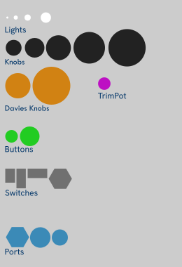

# Place Widgets with SVG

One of the most challenging things when making module panels is keeping your widget positioning in sync with a changing panel design.
[Hot-reload SVGs](./hot-svg.md#hot-reload-svgs) helps with that.

The Rack Tutorial provides `helper.py`, a script that reads a panel SVG and generates source code to create and position widgets.
This code-generation approach works ok for first-time bootstrapping a plugin, but it doesn't hold up  for iteration on the module and panel designs.
It also supports only a small selection of stock Rack components.

The approach here has similarities to the Rack Tutorial scheme where named placeholders are introduced into the SVG.
But the similarity pretty much ends there.
Here we need no scripts or special build process.
We create a panel SVG and use runtime code to get the information we need.

The basic design here is:

1. Add a placeholder for a widget.
1. Set a unique id for the placeholder using the **id** attribute for the element.
1. At `ModuleWidget` creation time, use a helper to read out coordinates for positioning the widget.
1. Once widgets have been created, hide placeholders as needed.

## Designing a panel

A simple idea for designing a panel is to simply import the SVGs for the widget.
Rack component library widgets are mostly composed of layers of SVGs, so you'd need to make a library of design components that have the right look.

While this gives you an image that has the final look of the module,
it is a lot of inital work to create the design components, and you really can't leave them in your shipped panel.
It adds a lot of size and complexity, and in some cases, won't be perfectly hidden by actual widgets.

## Adding SVG placeholders

I recommend taking a "wireframe" approach.
Simple circles and rectangles represent the knobs, buttons, ports, and switches.
In Inkscape, drop a circle or rectangle and type the radius or dimensions in the toolbar.
It works best to use a filled shape without a stroke.

For dimensions, a simple heuristic is to refer to the `viewBox` element in the component library SVG.
It's quickest to open the SVG in a text editor and read it out.
It's an attribute on the svg element at the top of the file.

```svg
<svg ... viewBox="0 0 16 16"
```

| Widget | Reference SVG or dimension |
| -- | -- |
| knob   | a circle the radius of the background (`*_bg.svg`) |
| button | circle the radius of the "up" SVG (`*_0.svg`) |
| slider | slider background SVG |
| switch | first SVG (`*_0.svg`) |
| tiny light   | circle radius 2.9px |
| small light  | circle radius 5.8px |
| medium light | circle radius 8.8px |
| large light  | circle radius 14.7px |

The design folder in this repository includes `wireframe.svg` with placeholders
for common VCV components.
The ids are based on the name of the Rack component they correspond to.
The file is highly simplified and amenable to copy and paste using a text editor.
If copying these in Inkscape, use Ctrl+Click to select an individual placeholder from the group it is in.



I often work on the same svg in inkscape and a text editor side-by-side.
After saving in the text editor, use _File_ / _Revert_ to reload it in Inkscape.
VSCode and other programming text editors will automatically reload a file after it is changed on disk, sometimes only if it hasn't been modified since the last load.

## SvgQuery helpers

SVG helper code is included here:

| File | Description |
|--|--|
| [`src/svg-query.hpp`](../src/svg-query.hpp) | SVG helper Header  |
| [`src/svg-query.cpp`](../src/svg-query.cpp) | SVG helper implementation. |

The main function `itemBounds` returns the bounding rectangle of an element in the svg given the item id (case sensitive).
The bounds can then be used to calculate the position of a widget in relation to the svg element.
The bounds rect is a `::Rack::math::Rect`, which has many useful methods for getting coordinates such as the center, and other operations.
So, for `createWidgetCentered`, pass the position from `itemBounds(...).getCenter()`.

If the id isn't found, the rectangle is a (Infinity,Infinity,0,0) rectangle.

(**#d todo** does this result in an assertion in Rack, a diagnostic log, or just an invisible widget?)

> **#d TODO** Add examples, hot-swap svg integration, and the enhanced svg_query from WIP pachde1

| | |
|--|--|
|  | Copyright © Paul Chase Dempsey |
